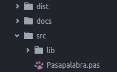

### Estructura de directorios

Al comenzar a trabajar en el proyecto lo primero que se hace es definir la estructura
de directorios que tendrá el mismo.

Para una mejor organización de los archivos, todos los archivos que contienen código
son puestos dentro del directorio `src`. A su vez, las *units* son puestas dentro del
directorio `src/lib`.

En el directorio `docs` se almacenan los archivos que contienen documentación, por
ejemplo, el manual de usuario, convenciones de código, etc.

Finalmente, en el directorio `dist` se guardan los binarios compilados.

>

 
<small>Estructura de directorios</small>

### Compilación

Para compilar el proyecto respetando la estructura de directorios anteriormente mencionada, se debe ejecutar
el siguiente comando:

`fpc -Fu"src/lib/" -B "src/Pasapalabra.pas" -o"dist/Pasapalabra"`

O en su defecto ejecutar el script `build.sh`.

La bandera `-Fu` indica el directorio en el cual se encuentran las *units*, `-B` le dice al compilador
que compile todos los módulos (compila el programa y todas las *units*) y `-o` indica el archivo de
salida.
