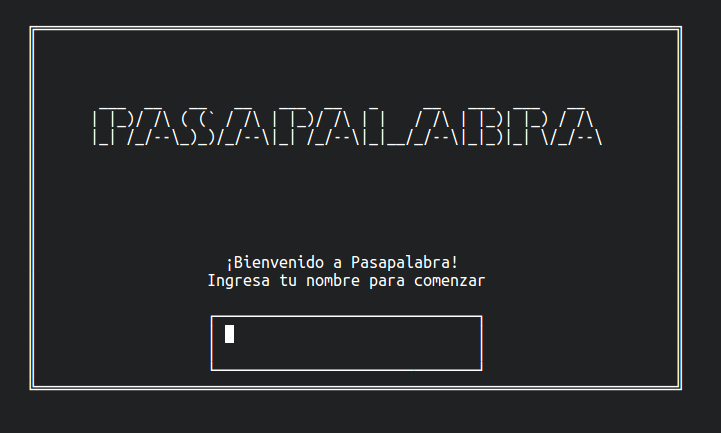
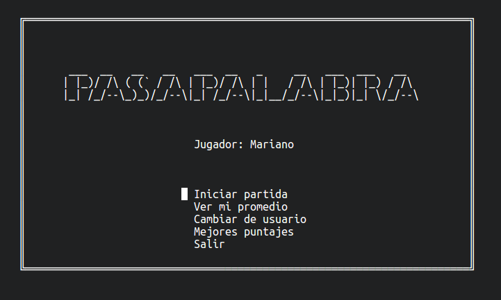
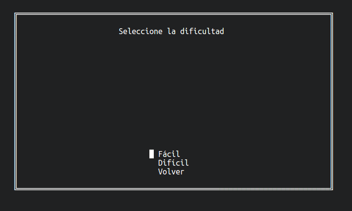
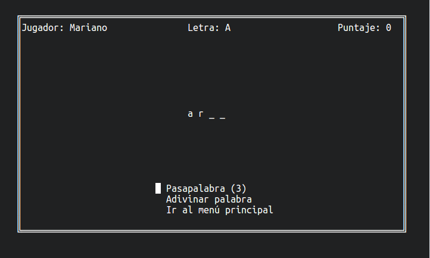
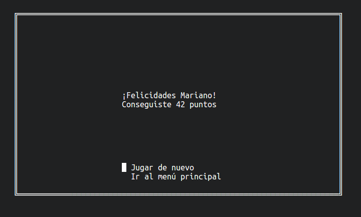
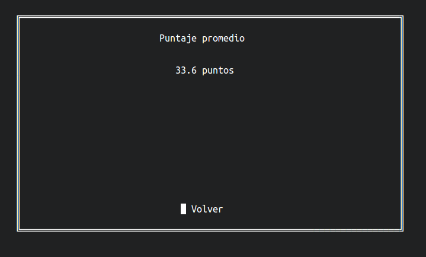
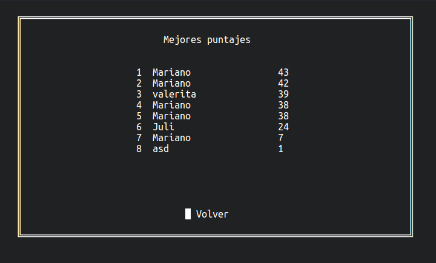

# PASAPALABRA - Manual de usuario

Pasapalabra es un juego que consiste en adivinar palabras. Tiene 2 niveles, *fácil* y *difícil*,
en los cuales se ocultan 2 o 3 letras en cada palabra respectivamente. El usuario tiene la opción de
adivinar la palabra, o pasarla e intentar adivinarla en la segunda ronda. No se pueden pasar más de
3 palabras consecutivamente. Adivinar una palabra en la primera ronda otorga 2 puntos, mientras que
en la segunda ronda sólo otorga 1.

### Empezando a jugar

Para ejecutar el juego, se debe ejecutar el comando `./play`. Una vez abierto, lo primero que veremos
será una pantalla de bienvenida en la que ingresaremos nuestro nombre para empezar a jugar.

>

 
<small>Pantalla de bienvenida</small>

### Menú principal

Una vez ingresado nuestro nombre, nos encontraremos en el menú principal, el cual nos da las siguientes
opciones:

* Iniciar partida
* Ver mi promedio
* Cambiar de usuario
* Mejores puntajes
* Salir

>

 
<small>Menú principal</small>

A continuación explicaremos con detalle cada una de las opciones.

#### Iniciar partida

Esta opción nos permite comenzar a jugar. Antes de empezar, se nos preguntará si queremos jugar en nivel
*fácil* o *difícil*.

>

 
<small>Selección de nivel</small>

Una vez seleccionado el nivel, comenzaremos a jugar. Lo primero que veremos en la pantallá será la palabra
que debemos adivinar, con algunas de sus letras tapadas. Además tendremos en la parte superior nuestro nombre,
la letra con la que estamos jugando y nuestro puntaje.

Cada vez que obtenemos una nueva palabra para adivinar tenemos 3 opciones. Pasapalabra, que nos permite pasar
e intentar adivinar la palabra en la segunda ronda, adivinar, que nos permite adivinar la palabra, e ir al menú
principal, que como su nombre lo indica, nos lleva nuevamente al menú principal.

>

 
<small>Adivinando una palabra</small>

Cuando completamos las dos rondas, vemos una pantalla informándonos cual ha sido nuestro puntaje, y ahí tenemos
la opción de volver a jugar o ir al menú principal.

>

 
<small>Final de la partida</small>

#### Ver mi promedio

Esta opción nos permite ver el puntaje promedio de las partidas que hemos jugado.

>

 
<small>Puntaje promedio</small>

#### Cambiar de usuario

Al cambiar de usuario, volveremos a la pantalla de bienvenida, permitiendonos ingresar un nuevo nombre para
comenzar a jugar.

#### Mejores puntajes

Como su nombre lo indica, esta opción nos permite ver los 10 mejores puntajes del juego.

>

 
<small>Mejores puntajes</small>

#### Salir

Sale del juego.
